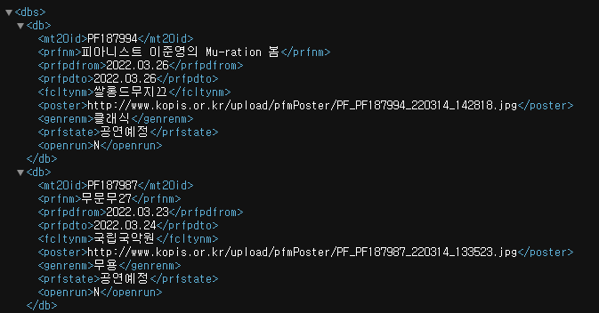

# 데이터 수집하기

## OPEN API(xml)를 이용한 데이터 수집

> 현재 데이터 수집을 위한 test를 해보기 위해 test.py를 생성 후 간단한 test를 실행했다.
>
> 요청 url: http://www.kopis.or.kr/openApi/restful/pblprfr?service={서비스키}&stdate=20220301&edd ate=20220431&rows=40
>
> -  22.03.01부터 22.03.31 이내에 이루어지는 공연 40개를 가져오는 왔다.



- 위와 같은 형식으로 xml 파일로된 데이터를 불러온다.
- root는 <dbs>, dbs의 child는 <db>가 되며, db는 총 40개의 공연데이를 불러온다.

```python
import requests
from bs4 import BeautifulSoup

api_url = 'http://www.kopis.or.kr/openApi/restful/pblprfr?service={서비스키}&stdate=20220301&eddate=20220331&cpage=1&rows=40'

res = requests.get(api_url)

# XML도 Html과 같이 html parser를 이용한다.
bs = BeautifulSoup(res.content, 'html.parser')

# dbs 태그를 모두 불러와서 data 변수에 저장
data = bs.find_all('db')

for db in data:
    show_id = db.find('mt20id')
    show_name = db.find('prfnm')

    print('{} : {}'.format(show_id.get_text(), show_name.get_text()))
```

- for 문을 통해 불러온 40개의 데이터를 모두 확인하여 공연id와 공연으름을 print로 출력하면 다음과 같은 결과 값이 나타난다.


- 정상적으로  id 값을 불러올 수 있는 것을 확인했다. 
- 이후 id를 모두 리스트에 저장 한 후 상세공연을 통해 상세 공연 정보를 불러와 보자.

```python
# 공연상세정보를 조회하는 url에 id를 넣고 조회한다.
show_url = 'http://www.kopis.or.kr/openApi/restful/pblprfr/' + \
    show_list[0] + '?service=1ac28adcb4b3407cb9e8a18355c8ae60'

show_res = requests.get(show_url)

show_bs = BeautifulSoup(show_res.content, 'html.parser')

show_data = show_bs.find_all('db')

print(show_data)
```

- show_list에 이전에 했던 작업을 통해 얻은 공연id 값을 저장한다.
- 이후 test를 위해 show_list에서 데이터 하나만 얻은 후 상세정보 조회를 하면 다음과 같이 결과 값이 나타난다.


- 다음과 같이 데이터를 불러 올 수 있다.
- 이후 DB에 저장시 태그안의 text만 저장하면 될 것이다.

