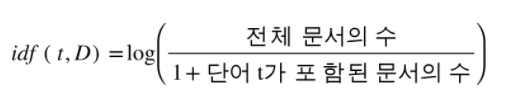
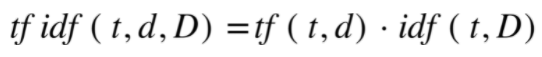
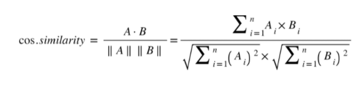

# SUB 2

## 데이터 과학 라이브러리

- Numpy
- Scipy
- Scikit-learn


### Numpy

> 다차원 배열의 행렬 연산을 빠르게 수행하기 위한 데이터 구조를 제공한다.
>
> [튜토리얼 참고]([Python Numpy Tutorial (aikorea.org)](http://aikorea.org/cs231n/python-numpy-tutorial/#numpy))

- rank: 배열의 차원
- shape: 각 차원의 크기를 알려주는 정수들이 모인 튜플

```python
mport numpy as np

a = np.array([1, 2, 3])  # rank가 1인 배열 생성
print type(a)            # 출력 "<type 'numpy.ndarray'>"
print a.shape            # 출력 "(3,)"
print a[0], a[1], a[2]   # 출력 "1 2 3"
a[0] = 5                 # 요소를 변경
print a                  # 출력 "[5, 2, 3]"

b = np.array([[1,2,3],[4,5,6]])   # rank가 2인 배열 생성
print b.shape                     # 출력 "(2, 3)"
print b[0, 0], b[0, 1], b[1, 0]   # 출력 "1 2 4"

a = np.zeros((2,2))  # 모든 값이 0인 배열 생성
print a              # 출력 "[[ 0.  0.]
                     #       [ 0.  0.]]"

b = np.ones((1,2))   # 모든 값이 1인 배열 생성
print b              # 출력 "[[ 1.  1.]]"

c = np.full((2,2), 7) # 모든 값이 특정 상수인 배열 생성
print c               # 출력 "[[ 7.  7.]
                      #       [ 7.  7.]]"

d = np.eye(2)        # 2x2 단위행렬 생성
print d              # 출력 "[[ 1.  0.]
                     #       [ 0.  1.]]"

e = np.random.random((2,2)) # 임의의 값으로 채워진 배열 생성
print e                     # 임의의 값 출력 "[[ 0.91940167  0.08143941]
                            #                  [ 0.68744134  0.87236687]]"
```

- 슬라이싱: 파이썬 리스트와 유사하게 Numpy의 배열에서도 슬라이싱이 가능하다.

```python
import numpy as np

# Create the following rank 2 array with shape (3, 4)
# [[ 1  2  3  4]
#  [ 5  6  7  8]
#  [ 9 10 11 12]]
a = np.array([[1,2,3,4], [5,6,7,8], [9,10,11,12]])

# 슬라이싱을 이용하여 첫 두 행과 1열, 2열로 이루어진 부분배열을 만들어 봅시다;
# b는 shape가 (2,2)인 배열이 됩니다:
# [[2 3]
#  [6 7]]
b = a[:2, 1:3]

# 슬라이싱된 배열은 원본 배열과 같은 데이터를 참조합니다, 즉 슬라이싱된 배열을 수정하면
# 원본 배열 역시 수정됩니다.
print a[0, 1]   # 출력 "2"
b[0, 0] = 77    # b[0, 0]은 a[0, 1]과 같은 데이터입니다
print a[0, 1]   # 출력 "77"
```


### Scipy

>  계산과학 분야에 사용되는 다양한 수학 알고리즘이 모여있다.
>
>  Numpy 데이터 구조를 기반으로 하여 복잡한 알고리즘을 구현하여 제공한다.


### Scikit-learn

> 데이터 마이닝 및 분석에 필요한 효과적인 기능을 제공한다.
>
> Numpy 및 Scipy로 만들어졌으며, 분류, 클러스터링, 차원 축소, 회귀 등 다양한 머신러닝 기법을 제공한다.
>
> TF-IDF, 코사인 유사도 계산시 이용.


## 컨텐츠 기반 필터링

> 사용자와 아이템 각각에 대한 이해를 바탕으로 추천하는 방식으로 아이템의 특성을 뽑아내는 것이 중요하다.
>
> 단점 
>
> - 다양한 형식의 항목을 추천하기 어렵다.

 ex ) 추천대상 : 영화

- 객관적 특성 - 장르, 감독, 배우, 제작사 등
  - 영화 메타 데이터를 적절히 가공하여 벡터화
 - 주관적 특성 - 리뷰, 평점 등 사용자 기준으로 작성된 특성
   - 텍스트 데이터의 경우 NLP(자연어 처리) 기법을 통한 기술을 이용한다.

### TF-IDF 

> 단어의 빈도를 의미하는 Term Frequency와 문서 빈도(Document Frequency)의 역수인 IDF(Inverse Document Frequency) 합성어로, 어떤 단어가 특정 문서 내에서 얼마나 중요한 것인지를 나타내는 통계적 수치
>
> [참고자료](https://blog.naver.com/myincizor/221823805086)

#### TF

- tf(t,d) = 문서 d에서 단어 t가 언급된 횟수
- 특정 단어의 빈도가 늘어나면 무한대로 값이 커질 수 있다.

#### IDF


- 문서의 수가 많아 지거나, 특정 단어가 포함된 문서가 없을 때 분모가 0이 되는 이슈도 발생한다.
- 이를 보완 하기 위해 분모에 작은값을 더하고 log를 취해 앞서 말한 문제를 방지한다.



#### TF - IDF

- 특정 문서에서 언급된 단어들의 가중치를 통해 핵심어를 파악하고 유사도를 알 수 있다.



### NLP

- Word2Vec
- Doc2Vec
  - 단어의 등장 빈도를 바탕으로 단어의 의미가 같은 맥락에서 사용되면 가까이 아니면 멀도록 단어를 벡터화 한다.
- Topic Modeling


## 협업 필터링

> 대규모의 사용자 행동 정보(사용자들의 리뷰, 시청 여부 , 구매 여부 등을 통한 데이터)를 분석해 해당 사용자와 비슷한 성향의 사용자들이 기존에 좋아했던 항목을 추천하는 기술이다.
>
> 단점
>
> - 콜드 스타트
> - 계산 효율 저하: 계산량이 많은 알고리즘이라 사용자 수가 많은 경우 오랜시간 소요
>   - 알고리즘 수행 전 필터링을 통해 일부 아이템 제거 -> 너무 많이 제거 할경우 tradeoff 발생
> - 롱테일 문제: 특정 인기 컨텐츠가 많은 비율을 차지에 인기가 저조한 컨텐츠는 정보 부족으로 추천 x

 - Memory-Based
   - Usered-Based
     - 구매 기록 등을 통해 같은 제품을 구매한 기록이 있는 사용자들을 찾아 추천하는 방식
   - Item-Based
     - 아이템 중심으로 찾는 방식
 - Model-Based
   - User-Item 행렬이 임의의 잠재 요소들을 통해 결정된다는 것을 가정
   - User-Item 행렬을 User-Latent Feature 행렬과 Item-Latent Feature 행렬로 분리하고 각 행렬의 값을 최적화를 통해 알아내는 머신 러닝적 접근 방식.


### 항상블 체계

- 넷플릭스의 경우 협업 필터링과 컨텐츠 기반 필터링의 단점을 보완 하기 위해 사용
- 먼저 동일한 영상을 시청한 유저들이 비슷한 행동 패턴을 보이면, 같은 프로파일링 그룹으로 묶고 협업 필터링을 사용합니다.  나아가 콘텐츠 기반 필터링 방식을 섞는데, 이 때 AI 뿐만 아니라 대규모의 인력을 활용해 보유한 컨텐츠를 태그화하는 작업을 수행하여 컨텐츠에 구체적인 속성을 부여.
- 오늘날의 추천 알고리즘은 대부분 이러한 앙상블 체계를 사용하고 있습니다.


## 유사도 측정 지표

> 유사한 유저, 아이템, 잠재 벡터를 찾기 위해선 유사도를 수치화 할 지표가 필요하다. 이 지표는 다양하며 사용 방법에 따라 결과값이 서로 다르게 나타나기 때문에 여러 지표의 결과를 적절히 조합하여 사용한다.

 - 유클리드 거리
   - [참고자료](https://forensics.tistory.com/49)
 - 코사인 유사도
   - [참고자료](https://widocs.net/24603)
   - 두 벡터 사이의 코사인 각도를 구해 서로의 유사도를 구하는 방식이며 데이터 크기의 차이에 관계없이 유사도를 비교할 수 있다.
   - 데이터의 크기에 관계없이 각도로만 판단하기 때문에 데이터셋 의 차이가 나더라도 유사도를 판단 할 수 있다.
   - 
 - 피어슨 상관 계수
   - [참고자료](https://towardsdatascience.com/collaborative-filtering-based-recommendation-systems-exemplified-ecbffe1c20b1)

