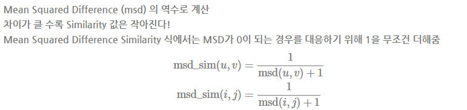

# 0316 TIL

오늘은 REST API 문서에 대한 작업을 하고 전반적으로 팀 작업 현황과 지식을 공유하는 형태의

스크럼을 진행했습니다.

로그인 방식의 경우에는 카카오 로그인 방식을 도입하려고 했는데

REST API 문서 작성 단계에서 우리가 Backend 에서 딱히 해줄건 없고 

kakaoaccount 사이트로 리다이렉트 해주는 방식이라 크게 만질 건 없는데

정확히 이해하는데는 시간이 걸려서 잠정 보류

어떻게 진행 할 것인지 Development flow를 오늘 어느정도 가닥을 잡았고,

전문가님 미팅 때, 질문 할 부분을 추리고 그 부분에 대한 답변에 따라서 변동되는 부분이 생길 수도?

모델 기반 추천을 사용하는데

분석한 결과에 따른 가중치를 구하는 부분에 대해서 좀 알아 볼 필요성이 느껴진다.

찾아본 결과 문과출신이 보기에는 수식이 ... 굉장히 복잡해서 명세서라도 잘 살펴봐야 할듯

## 유사도 계산 방식

### 평균제곱차이 유사도

Mean Squared Difference, MSD

- 

### 코사인 유사도

두 특성 벡터간의 유사 정도를 코사인 값으로 표현한 것

Cosine Similarity는 -1에서 1까지의 값을 가지며, -1은 서로 완전히 반대되는 경우, 0은 서로 독립적인 경우, 1은 서로 완전히 같은 경우를 의미함

### 피어슨 유사도

피어슨 유사도는 두 벡터의 상관계수 (Pearson correlation coefficent)를 의미

피어슨 유사도는 유사도가 가장 높을 경우 값이 1, 가장 낮을 경우 -1의 값을 가짐

특정인물의 점수 기준이 극단적으로 너무 낮거나 높을 경우 유사도에 영향을 크게 주기 때문에, 이를 막기 위해 상관계수를 사용하는 방법

수식 및 자료 출처 : https://www.fun-coding.org/recommend_basic3.html
