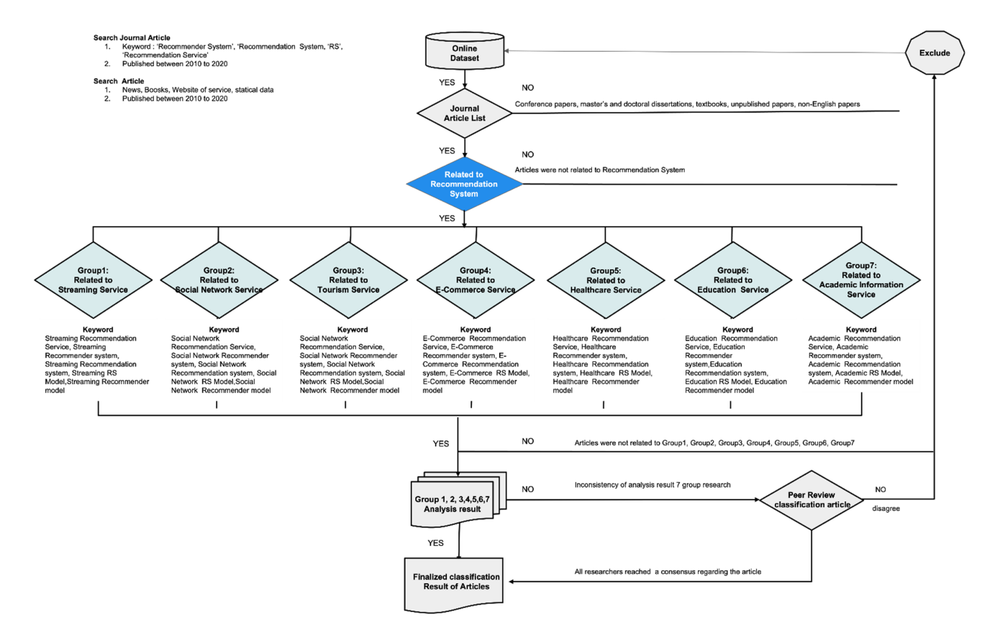

## 빅데이터 논문 리뷰

#### 논문 제목 : A Survey of Recommendation Systems: Recommendation Models, Techniques, and Application Fields

#### 선정 이유 : 2010 ~ 2021년 동안 나온 추천관련 알고리즘, 모델, 기술들을 잘 요약해둔 논문이라고 판단하여 진행하였다.

##### 1. introduction

왜 추천 서비스가 중요한지, 29년 전부터 나온 추천 시스템이 왜 지금 조명되고 있는지 소개하고 있다.

또한 저널사이트가 한정되어 있어 이외에도 추가적으로 더 있을것이라고 알려줌

##### 그림 1

저널에 있는 논문을 종류별로 분류 (keyword)

##### 그림 2

그림1과 마찬가지

여기서 우리는 키워드에 집중해야한다.

우리 서비스는 공연 추천 서비스 이므로, tourism, E-commerce에 가깝다고 생각한다.

##### keyword 분석

Social Network Recommendation Service

Social Network Recommender system

social network recommendation system

social network RS model

social network recommender model

e-commerce Recommendation service

e-commerce Recommender system

e-commerce Recommendation system

e-commerce RS Model

e-commerce Recommender model

계속해서 나오는것이 **Recommendation service, Recommender system, recommendation system, RS model, recommender model**이므로 조사할 필요가 있다.

