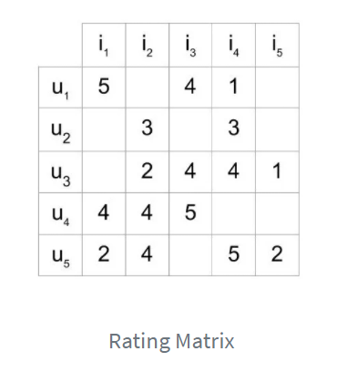
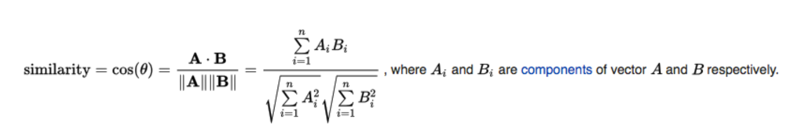
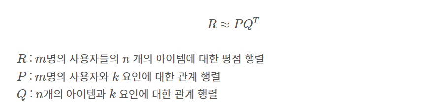
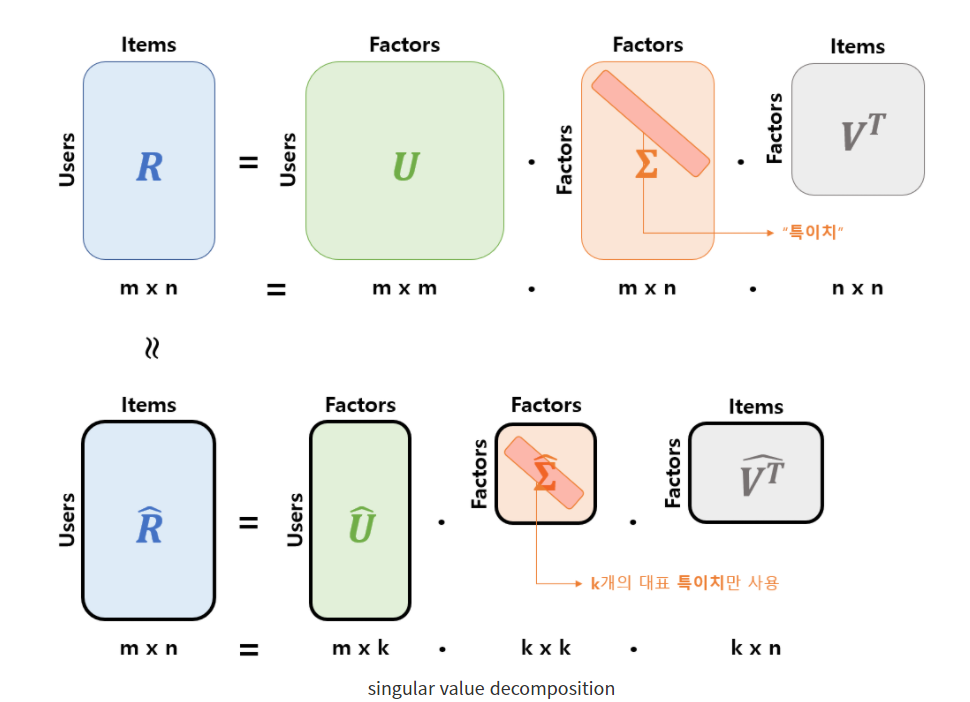
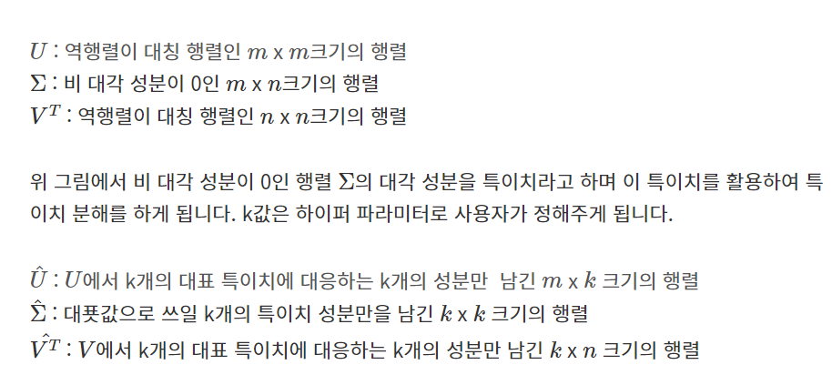

# Sub2 Project

> 리뷰 기반 추천 프로젝트


- 필수 라이브러리
  - 데이터 과학 라이브러리
    - Numpy
    - Scipy
    - Scikit-learn


## 컨텐츠 기반 필터링(Content Based Filtering)

> 추천의 대상이 되는 아이템과 사용자에 대한 이해를 바탕으로 추천하는 방식


- 아이템 각각에 대한 이해를 바탕으로 추천하는 방식이므로 아이템의 특성을 뽑아내는 것이 중요


### 컨텐츠 기반 추천 알고리즘 개념 정리

- https://brunch.co.kr/@kakao-it/72
  - 추천 알고리즘 개념 정리
  - CF, CB, 앙상블 기법

- https://www.samsungsemiconstory.com/kr/%EB%B0%B1%EB%B0%9C%EB%B0%B1%EC%A4%91-%EC%B7%A8%ED%96%A5%EC%A0%80%EA%B2%A9%EC%88%98-%EC%B6%94%EC%B2%9C-%EC%95%8C%EA%B3%A0%EB%A6%AC%EC%A6%98%EC%9D%98-%EB%B9%84%EB%B0%80/
  - 콘텐츠 기반 필터링, 협업 필터링 개념 요약


### TF-IDF

> 단어의 빈도를 의미하는 Term Frequency와 문서 빈도(Document Frequency)의 역수인 IDF(Inverse Document Frequency) 합성어로, 어떤 단어가 특정 문서 내에서 얼마나 중요한 것인지를 나타내는 통계적 수치
>
> 단어들의 중요도를 통해 문서의 핵심어들이나 각 문서가 얼마나 비슷한지 정도를 파악할 수 있다.

- 코사인 유사도

  - 두 벡터 간의 코사인 각도를 이용하여 구할 수 있는 유사도

  - 완전히 동일하면 1, 90도 각도를 이룬다면 0, 반대 방향인 경우 -1

  - 데이터 크기의 차이에 관계없이 유사도 비교 가능

- TF

  - 단어의 빈도(Term Frequency)

  - ```
    tf(t, d) = 문서 d에서 단어 t가 언급된 횟수
    ```

  - 그냥 문서에 단어 갯수를 세면 된다.
  - **단어 빈도가 늘어날 수록 값이 커지므로 이를 보정하기 위해 단어가 언급되었는지만 체크하거나 빈도수에 로그를 취하는 방법으로 수치를 정규화 할 수도 있음**

- IDF

  - 역 문서 빈도

  - DF(문서 빈도)의 역수를 취한 형태

  - 여러 문서들에서 특정 단어의 등장 횟수가 적을수록 그 단어에 가중치가 부여

  - ```
    df(t, D) = 단어 t가 포함된 문서의 수 / 전체 문서(D)의 수
    
    idf(t, D) = 전체 문서의 수 / 단어 t가 포함된 문서의 수
    ```

  - 단어가 몇 번 언급되었는지는 상관 없다. 한 문서에 단어가 한 번이라도 언급되었으면 카운트

  - 특정 단어가 포함된 문서가 없을 때 부모가 0이 되는 이슈도 발생할 수 있으므로 분모에 +작은 값(주로 1)으로 보정한 후 전체 값에 log를 씌워 문제 방지. 로그는 자연로그를 사용

    - 식 수정

    - ```
      idf(t, D) = log(전체 문서의 수 / 1 + 단어 t가 포함된 문서의 수)
      ```

  - 많은 문서에서 언급된 표현들은 최하의 가중치를 받고, 특정 문서에서만 언급된 단어는 높은 가중치를 받는다.

- TF-IDF

  - TF와 IDF를 곱한 값

  - 특정 단어가 한 문서에서 몇 번 언급되었으며, 문서군에서는 얼마나 유니크한가를 표현한 가중치

  - ```
    tf idf(t, d, D) = tf(t, d) * idf(t, D)
    ```

  - 특정 문서에서 언급된 단어들의 가중치를 통해 그 문서의 핵심어를 파악할 수 있으며 나아가 핵심어 들을 통해 각 무서들의 비슷한 정도도 유추할 수 있다.


#### 장점

- 어떤 단어가 중요한 단어인지 직관적으로 해석이 가능하며, 전처리가 잘 수행되었을 때 다른 변수선택/추출보다 좋은 성능을 가지고 있다.

#### 단점

- 제외된 단어들은 학습에 사용되지 않기 때문에 새로운 단어에 대한 해석이 불가
- 순서를 고려하지 않기 때문에 어순에 대한 문법적인 의미를 담고 있지 않음


#### 정리

- 해리포터와 반지의 제왕을 TF-IDF 기법으로 분석한 예시
  - https://blog.naver.com/myincizor/221823805086
    - TF-IDF를 활용하면 특정 문서의 핵심어를 찾을 수 있다.
    - 어떤 문서군을 기준으로 삼느냐에 따라 IDF 가 달라지므로 핵심어도 달라질 수 있다.
    - 이렇게 파악한 핵심어로 어떤 문서가 비슷한지도 유추할 수 있다.
      - 핵심어로 서로 유사도가 높은 문서군을 찾을 수 있음
      - ex) 판타지 소설군에서 해리포터 시리즈의 핵심어는 '해리포터'와 '호그와트'이므로 해리포터 시리즈의 문서들은 서로 유사도가 높게 나올 것임을 아 수 있음


- scikit-learn 에서 제공하는 TF-IDF 함수
  - https://scikit-learn.org/stable/modules/generated/sklearn.feature_extraction.text.TfidfVectorizer.html


- TF-IDF 활용 예시와 시각화 방법 정리
  - https://donghwa-kim.github.io/TFIDF.html


### NLP


#### Word2Vec 텍스트 임베딩 예시

- python을 이용한 콴다 리뷰 분석
  - https://blog.mathpresso.com/python%EC%9D%84-%EC%9D%B4%EC%9A%A9%ED%95%9C-%EC%BD%B4%EB%8B%A4-%EB%A6%AC%EB%B7%B0-%EB%B6%84%EC%84%9D-73b3f26e967c


#### Doc2Vec을 사용한 리뷰 감정 분류

- Word2Vec의 일반화
- https://ichi.pro/ko/doc2veceul-sayonghan-libyue-daehan-gamjeong-bunlyu-112200208663350


#### LDA를 활용한 토픽 모델링 방법론

- 말뭉치로부터 토픽을 추출하는 토픽 모델링 기법 중 하나인 LDA
- 잠재 의미를 고려하여 토픽을 추출하는 방법

- https://skb.skku.edu/sic/study.do?mode=view&articleNo=117911&article.offset=0&articleLimit=10#/list
- 토픽 모델링
  - 토픽 모델링에서 토픽은 어떤 주제를 구성하는 단어들
  - 문서 집합에서 이 단어 집합을 찾는 것이 토픽 모델링
  - 참고)
    - https://blog.naver.com/PostView.naver?blogId=hobby-explorer&logNo=222219351460&categoryNo=13&parentCategoryNo=0
    - http://bigdata.emforce.co.kr/wp-content/uploads/%EC%97%A0%ED%8F%AC%EC%8A%A4-%EB%8D%B0%EC%9D%B4%ED%84%B0%EB%9E%A9_%ED%86%A0%ED%94%BD%EB%AA%A8%EB%8D%B8%EB%A7%81LDA%EB%B0%A9%EB%B2%95%EB%A1%A0-%EC%A0%95%EB%A6%AC.pdf
    - https://dianakang.tistory.com/m/50


## 협업 필터링(Collaborative Filtering)

> 사용자의 상품(아이템)에 대한 기록 정보를 바탕으로 특성 벡터를 직접 수치화 하는 것이 아닌 머신 러닝 방식으로 자동적으로 수치화함으로써 각 사용자가 무엇을 좋아할 지를 예측하는 기법


- Memory-Based
  - User-Based
    - 구매 기록 등을 통해 같은 제품을 구매한 기록이 있는 사용자들을 찾고 이를 바탕으로 아이템을 추천하는 방식
  - Item-Based
    - 사용자를 중심으로 찾는 방식이 아닌 아이템 중심으로 추천하는 방식
- Model-Based
  - User-Item 행렬이 임의의 잠재 요소들을 통해 결정된다는 가정 하에 User-Item 행렬을 User-Latent Featuer 행렬과 Item-Latent Feature 행렬로 분리하고 분리된 각 행렬의 값을 최적화를 통해 알아내는 머신 러닝적 접근ㄴ 방법
  - 어떤 요소가 구ㅐ나 시청, 리뷰 점수로 이어졌는지 파악하기 힘들지만 기록이 어느 정도 쌓였다는 가정 하에 단순 컨텐츠 기반 필터링보다 성능이 크게 개선된 방법


### 협업 필터링 개념 정리

- https://realpython.com/build-recommendation-engine-collaborative-filtering/
  - 협업 필터링 알고리즘 개념정리, 코드 예시
  - 협업 필터링을 위해서는 아이템 set과 이 아이템에 반응하는 유저 set이 필요
  - 반응(reaction)에는 explicit(ex_1점부터 5점까지 평점 매기기, 좋아요 누르기 등) 명시적인 반응과 implicit(아이템 조회, 위시 리스트에 추가, 기사를 본 시간) 묵시적인 반응이 있다.
  - cosine distance를 통해 유저 행동 간 유사도를 계산 가능
  - example) 다섯 명의 유저와 다섯 명의 아이템 평점 행렬
    - 
    - 대개 이러한 행렬의 대부분의 cell들은 비어있을 것(user들이 모든 아이템에 대해서 react를 잘해주는 것이 아니기 때문)
      - 대부분 cell들이 비어있는 행렬을 sparse 행렬, 반대 개념을 dense 행렬이라고 부름


### Memory Based CF

- https://scvgoe.github.io/2017-02-01-%ED%98%91%EC%97%85-%ED%95%84%ED%84%B0%EB%A7%81-%EC%B6%94%EC%B2%9C-%EC%8B%9C%EC%8A%A4%ED%85%9C-(Collaborative-Filtering-Recommendation-System)/

  - 협업 필터링 추천 시스템 개념 정리(한글)

  - **Memory-based 협업 필터링**

    - 유사도를 기반으로 동작

    - 사용자-사용자 간 유사도를 기준으로 하면 User-based, 아이템-아이템 간 유사도를 기준으로 하면 Item-Based

    - 사용자 기반(User-Based)

      - 두 사용자가 얼마나 유사한 항목(아이템)을 선호했는지를 기준

      - 두 사용자 간 유사도 = 두 벡터 간 유사도

      - 대개 코사인 유사도, 피어슨 유사도가 사용된다.

      - **코사인 유사도 공식**

        

      - 해당 공식을 통해 구한 유사도 행렬 기반으로 weighted sum 값을 예측 점수로 사용할 수 있음

    - 아이템 기반(Item-Based)

      - 사용자 기반과 유사한 과정을 거침. 다만 아이템들에 대한 유사도를 구해서 계산
      - 두 아이템 간 유사도가 높으면, A 아이템을 좋아하는 유저들이 B 아이템을 좋아할 확률(또는 반대)이 높음

    - **코사인 유사도 기반 필터링 주의점**

      - 극단적으로 다른 평가를 받은 두 아이템의 유사도는 1이 된다. 이처럼 코사인 유사도는 유저마다의 개인적인 평가 성향을 반영하지 못한다는 단점이 있다.

      - 보완점으로 **피어슨 유사도**가 있다.

      - 공식

        

    - 이외에도 평가 인원 수나 아이템들이 너무 적으면 추천의 정확도가 매우 떨어질 수 있으므로 최소 평가 인원을 정해서 그 이상부터 유사도를 계산하고 이하는 유사도를 0으로 두는 것이 바람직

- https://medium.com/sfu-cspmp/recommendation-systems-user-based-collaborative-filtering-using-n-nearest-neighbors-bf7361dc24e0
  - 영화 평점 데이터를 User-Based 방식의 협업 필터링 알고리즘 구현 예시


### Model Based CF

**기본 개념**

- https://lsjsj92.tistory.com/564

- 잠재 요인 협업 필터링(Latent Factor CF)
  - 행렬 분해(matrix factorization)을 기반하여 사용
  - 대규모 다차원 행렬을 SVD와 같은 차원 감소 기법으로 분해하는 과정에서 잠재 요인을 뽑아내는 방법
- 사용자  - 아이템 행렬 데이터를 이용해 잠재 요인을 찾아냄
  - `사용자 - 잠재요인`, `아이템 - 잠재요인` 으로 행렬을 분해
  - 잠재 요인의 개수, 특성을 무엇으러 정할지는 사용자에 따라 다르다.(하이퍼 파라미터) 


**SVD**

- https://seing.tistory.com/67 (파이썬 코드 포함)

  

- 평점을 기반으로 추천하려고 하는 경우, 모든 사용자들이 평점을 달거나 리뷰를 달진 않으므로 대부분의 유저-아이템 행렬이 sparse matrix(희소 행렬)이 된다.(대부분의 값이 비어있는 행렬)

  - 이를 해결하기 위한 방법 중 하나가 SVD

    




**경사하강법을 활용한 MF**

- https://yamalab.tistory.com/92 (파이썬 코드 포함)


## 추천 시스템 특화 라이브러리(파이썬)


### 추천 라이브러리 비교

- https://velog.io/@tobigs-recsys/RecommenderSystemLibraries


### LightFM

- https://towardsdatascience.com/recommendation-system-in-python-lightfm-61c85010ce17
  - LightFM을 이용한 추천 시스템 예시 코드(평점 기반)


### Surprise

- https://blog.cambridgespark.com/tutorial-practical-introduction-to-recommender-systems-dbe22848392b
  - Surprise를 이용한 추천 시스템 예시 코드 (평점 기반)


### PySpark

- https://www.youtube.com/watch?v=FgGjc5oabrA
  - ALS 알고리즘 예시
  - ALS 알고리즘
    - MF 를 통해 나온 유저-잠재요인, 아이템-잠재요인 행렬을 번갈아가면서 학습시키는 것


## 유사도 지표

**기본 개념**

- https://www.fun-coding.org/recommend_basic3.html
  - 평균제곱차이 유사도, 코사인 유사도, 피어슨 유사도 개념 설명 및 코드 예시

**유클리드 거리**

**코사인 유사도**

- https://wikidocs.net/24603
  - 코사인 유사도를 이용한 추천 예시

**피어슨 상관 계수**

- https://towardsdatascience.com/collaborative-filtering-based-recommendation-systems-exemplified-ecbffe1c20b1
  - 피어슨 상관 계수를 포함한 다양한 유사도 지표 개념 설명

**유사도 지표 비교**

- https://developers.google.com/machine-learning/recommendation/overview/candidate-generation


