# Docker를 활용한 CI/CD

## 목차

0. [사전 체크](#0-사전-체크)
1. [Docker 설치](#1-docker-설치)
   1. [Docker 패키지 설치](#11-docker-패키지-설치)
   2. [사용자를 Docker 그룹에 포함시키기](#12-사용자를-docker-그룹에-포함시키기)
   3. [Docker Compose 설치](#13-docker-compose-설치)
2. [Jenkins와 mysql 컨테이너 설치](#2-jenkins와-mysql-컨테이너-설치)
   1. [Jenkins Dockerfile 작성](#21-jenkins-dockerfile-작성)
   2. [docker-compose-작성](#22-docker-compose-작성)
   3. [Jenkins 설치](#23-jenkins-설치)
3. [MySQL 환경 설정](#3.-MySQL-환경-설정)
3. [Jenkins 환경 설정](#3-jenkins-환경-설정)
   1. [Jenkins 접속 및 초기 설정](#31-jenkins-접속-및-초기-설정)
   2. [Jenkins 플러그인 추가 설치](#32-jenkins-플러그인-추가-설치)
   3. [Jenkins에 환경변수 설정](#33-jenkins에-환경변수-설정)
   4. [시스템 설정](#34-시스템-설정)
4. [Jenkins 새로운 Item 설정](#4-jenkins-새로운-item-생성)
   1. [Freestyle Project 생성](#41-freestyle-project-생성)
   2. [Freestyle Project 설정](#42-freestyle-project-설정)
   3. [Web hook 설정](#43-web-hook-설정)
5. [Freestyle project 실행](#5-freestyle-project-실행)
   1. [dockerizing](#51-dockerizing)
   2. [execute-shell-작성](#52-execute-shell-작성)

------

## 0. 사전 체크

해당 문서는 아래와 같은 환경에서 실행되었습니다.

| Project     | Version |
| ----------- | ------- |
| Ubuntu      | 20.04   |
| Spring boot | 2.5.3   |
| fastApi     | 0.75.1  |
| MySQL       | 8.0.28  |
| Vue         | 2.6.11  |

[참고] [EC2 환경설정](Server-EC2-환경-설정.md)

## 1. Docker 설치

### 1.1. Docker 패키지 설치

- Docker 설치에 필요한 apt 패키지 설치

  ```bash
  $ sudo apt update
  
  # 의존성 패키지 설치
  $ sudo apt-get install apt-transport-https ca-certificates curl gnupg lsb-release
  
  # apt로 Docker 패키지를 설치하기 위해 인증키(GPG Key) 추가
  $ curl -fsSL https://download.docker.com/linux/ubuntu/gpg | sudo apt-key add -
  
  # Ubuntu 버전에 맞는 Docker를 설치하기 위해 repository에 추가
  $ sudo add-apt-repository "deb [arch=amd64] https://download.docker.com/linux/ubuntu $(lsb_release -cs) stable"
  
  # repository 업데이트
  $ sudo apt update
  
  # Docker 패키지 확인
  $ sudo apt-cache search docker-ce
  ```

- Docker 엔진 설치

  ```bash
  # Docker 설치
  $ sudo apt update
  $ sudo apt-get install docker-ce docker-ce-cli containerd.io
  ```

  > CE(Community Edition)은 기술지원 및 서비스 단계 시 각종 지원은 없지만, 개인 공부 및 개발 환경 사용에서 사용한다. (무료버전)

- 잘 설치되었는지 확인

  ```bash
  # Docker 버전 확인
  $ sudo docker --version
  
  # Docker 정보 확인
  $ sudo docker info
  ```

### 1.2. 사용자를 Docker 그룹에 포함시키기

- Docker 명령어를 sudo 권한 없이 실행하기 위해서 포함시킨다.

  ```bash
  # 현재 유저 확인
  $ echo $USER
  
  # docker 그룹에 현재 유저 추가
  $ sudo usermod -aG docker $USER
  
  # docker 재실행
  $ sudo service docker restart
  ```

### 1.3. Docker Compose 설치

> Install Compose on Linux 공식문서 : https://docs.docker.com/compose/install/

- Docker compose 설치

  ```bash
  # Docker Compose 다운로드
  $ sudo curl -L "https://github.com/docker/compose/releases/download/1.29.2/docker-compose-$(uname -s)-$(uname -m)" -o /usr/local/bin/docker-compose
  
  # 실행 권한 적용
  $ chmod +x /usr/local/bin/docker-compose
  
  # 심볼릭 링크 설정
  $ ln -s /usr/local/bin/docker-compose /usr/bin/docker-compose
  ```

- 설치 확인

  ```bash
  $ docker-compose --version
  docker-compose version 1.28.5, build c4eb3a1f
  ```

## 2. Jenkins와 MySQL 컨테이너 설치

> Jenkins은 설치 시 `jdk`, `git`, `gradle`이 필요하다. 
>
> 그러나 `gradle`은 spring boot를 통해 build되는 프로젝트에서 포함하고 있는 `내장 gradle`을 사용할 예정이므로 별도 설치 안한다.

### 2.1 Jenkins Dockerfile 작성

- `/home/ubuntu/PJT` 에서 Docker Compose 파일을 저장할 compose 폴더 생성 

  ```bash
  # compose 폴더 생성 후 이동
  $ mkdir compose
  $ cd compose
  ```

- `/home/ubuntu/PJT/compose` 에서 jenkins 폴더 생성

  ```bash
  $ mkdir jenkins
  $ cd jenkins
  ```

- 커스텀한 jenkins 이미지 생성을 위한  `Dockerfile` 작성

  ```bash
  # Dockerfile 파일 생성 및 작성
  $ vi Dockerfile
  ```

  ```dockerfile
  # Java 11 버전인 jenkins 이미지
  # spring boot의 java 버전과 맞춘다.
  FROM jenkins/jenkins:jdk11
  
  ## root 권한으로 지정
  USER root
  
  ## jenkins 컨테이너 내부에서 docker를 사용할 수 있도록 셋팅 시작
  RUN apt-get update
  
  # docker 설치
  RUN curl -fsSL https://get.docker.com/ | sh
  
  # docker-compose 설치
  RUN curl -L "https://github.com/docker/compose/releases/download/1.25.4/docker-compose-$(uname -s)-$(uname -m)" -o /usr/local/bin/docker-compose && \
      chmod +x /usr/local/bin/docker-compose && \
      ln -s /usr/local/bin/docker-compose /usr/bin/docker-compose
      
  RUN apt-get update
  RUN apt-get install -y docker-ce-cli
  ```

> #### [참고1] Docker In Docker ??
>
> - **jenkins 컨테이너 내부에 Docker를 설치해도 괜찮을걸까?** 
>   - 결론만 말하자면 **Docker daemon**이 아닌 **Docker CLI**는 설치해야 한다. <br/>[참고 블로그](https://postlude.github.io/2020/12/26/docker-in-docker/)
>   - `/var/run/docker.sock` 파일은 **Docker daemon**에게 명령을 내릴 수 있는 인터페이스. <br/>**Docker CLI**는 이 파일을 통해 daemon에게 명령어를 전달한다.<br/>[자세한 설명](https://medium.com/dtevangelist/docker-in-docker-fb54252e3188)
>
> #### [참고2] vi 명령어
>
> - `i` : 명령 모드에서 **입력 모드로 전환**
> - `ESC` : 입력 모드에서 **명령 모드로 전환**
> - **저장, 종료**하기 (명령모드에서 사용)
>   - `:q` : 종료
>   - `:q!` : 저장하지 않고 강제 종료
>   - `:w` : 저장
>   - `:wq` : 저장 후 종료
> - [그 외 명령어 보기](https://velog.io/@zeesoo/Linux-vi-%ED%8E%B8%EC%A7%91%EA%B8%B0-%EC%82%AC%EC%9A%A9%EB%B2%95-%EB%B0%8F-%EB%AA%85%EB%A0%B9%EC%96%B4)

### 2.2 docker-compose 작성

- compose로 이동한 후 `docker-compose.yml` 작성

  ```bash
  # compose로 이동
  $ cd ..
  ```

  ```yml
  version: "3" # 파일 규격 버전
  services: # 이 항목 밑에 실행하려는 컨테이너 들을 정의
    jenkins:
      container_name: jenkins
      build: #./jenkins 경로에 있는 Dockerfile 빌드
        context: ./jenkins
        dockerfile: Dockerfile
      user: root # 접속 유저 root
      restart: always
      environment:
        - TZ=Asia/Seoul
      ports:
        - 9090:8080
        - 50000:50000
      volumes: # 공유할 volumn 지정 (내 서버의 경로 : 도커 컨테이너의 경로)
        - /home/ubuntu/PJT/jenkins:/var/jenkins_home
        - /home/ubuntu/PJT/.ssh:/root/.ssh
        - /var/run/docker.sock:/var/run/docker.sock #로컬에 설치된 Docker를 컨테이너 내부에서 사용할 수 있도록 세팅
    database:
      image: mysql:8.0.28
      container_name: mysql
      restart: always
      environment:
        MYSQL_DATABASE: artsider  # artsider란 이름의 DB 생성
        MYSQL_ROOT_PASSWORD: bigdata@202  # root 패스워드 설정 옵션
        TZ: Asia/Seoul
      command: # 명령어 실행
        - --character-set-server=utf8mb4
        - --collation-server=utf8mb4_unicode_ci
      ports:
        - 3306:3306 # 접근 포트 설정 (컨테이너 외부:컨테이너 내부)
  ```

### 2.3 Jenkins와 MySQL 설치

- `docker-compose`파일이 있는 위치에서 실행한다.

  ```bash
  $ docker-compose up --build -d
  
  # jenins과 mysql 이미지와 컨테이너 확인
  $ docker images
  $ docker ps
  ```

## 3. MySQL 환경 설정

- MySQL 컨테이너 접속 및 MySQL 접속

  ```bash
  # 컨테이너 접속 : docker exec -it [컨테이너 이름] bash
  $ docker exec -it mysql bash
  
  # mysql 접속
  $ mysql -u root -p
  ```

- 사용자 생성 후 권한 부여

  ```sql
  # 모든 host에서 연결할 수 있는 사용자 생성: CREATE USER '사용자계정'@'%' IDENTIFIED BY '사용할 비밀번호';
  CREATE USER 'artsider'@'%' IDENTIFIED BY 'artsider202!';
  
  # 사용자 권한 부여
  GRANT ALL PRIVILEGES ON *.* TO 'artsider'@'%';
  
  # 권한 적용 새로고침 (안해도 됨)
  flush privileges;
  ```

  > [참고] 왜 사용자 계정을 추가하는 걸까?
  >
  > root 계정은 **높은 권한**을 가지고 있는 계정이기 때문에 **보안을 유지**해줘야 할 필요성이 있다.<br/>그러므로 DataBase를 생성한 뒤에 root 계정이 아닌 별도의 계정을 생성 및 권한을 설정하여 DataBase에 접근할 수 있도록 해주는 것이 좋다!

## 4. Jenkins 환경 설정

### 4.1 Jenkins 접속 및 초기 설정

- `http://${ec2-public-dns}:9090`으로 Jenkins 접속

  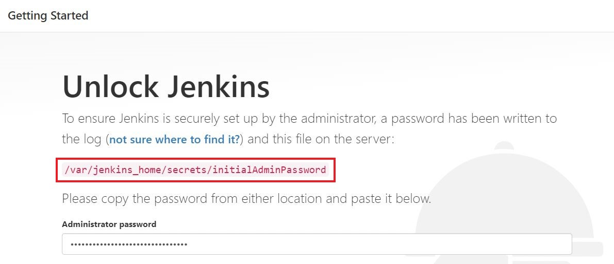

  - 초기 접속 비밀번호는 docker 컨테이너로 떠있는 jenkins의 **특정파일**안에 존재 (위 경로에 위치)
  - 실행 후 나온 패스워드를 복사해서 입력한 후 Continue 버튼 클릭

  ```bash
  # docker exec : 컨테이너로 접속
  $ docker exec jenkins cat /var/jenkins_home/secrets/initialAdminPassword
  ```

- `Intall suggested plugins` 눌러 추천 플러그인 설치

- 사용자 계정 생성 & 로그인

  - 계정은 반드시 생성해야 한다. 후에 재접속 시 필요함!

  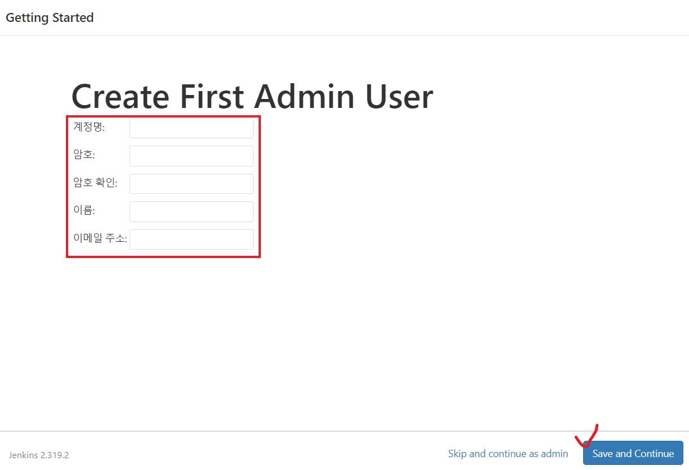

### 4.2 Jenkins 플러그인 추가 설치

- **Dashboard > Jenkins 관리 > 플러그인 관리** 클릭
  - `NodeJS`, `Blue Ocean`, `Gitlab` 관련된 것 모두 설치

### 4.3 Jenkins에 환경변수 설정

> Jenkins에서 사용하게 될 타 어플리케이션(`jdk`, `nodeJS`)에 대한 설정하기

- **Dashboard > Jenkins 관리 > Global Tool Configuration** 클릭

- **JDK** 환경변수 설정하기

  - Jenkins 컨테이너 안에 있는 **java 11의 위치** 알기

  ```bash
  $ docker exec -it jenkins /bin/bash
  
  # java 위치 확인
  $ whereis java
  
  $ exit
  ```
  
  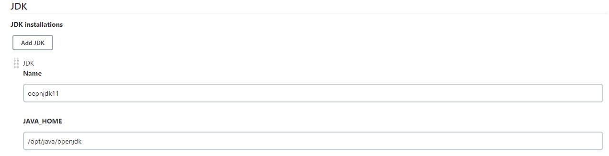
  
- **NodeJS** 등록

  - FrontEnd의 Vue에서 사용하는 버전과 일치

    ```bash
    # nodeJS 버전 알기
    $ node -v
    
    # npm 버전 알기
    $ npm -v
    ```

### 4.4 시스템 설정

- **Dashboard > Jenkins 관리 > 시스템 설정** 클릭

- **Gitlab Token** 발급 받기

  - **Gitlab → Settings  > Access Token**에서 발급받고 기억할 수 있는 장소에 저장한다.

    ```
    Name : access_token
    Scope : api 선택
    ```

- **GitLab**과 연동

  - Connection name, host URL 적절히 작성
  - Credentials가 **none** 이라면 `Add > Jenkins` 클릭

  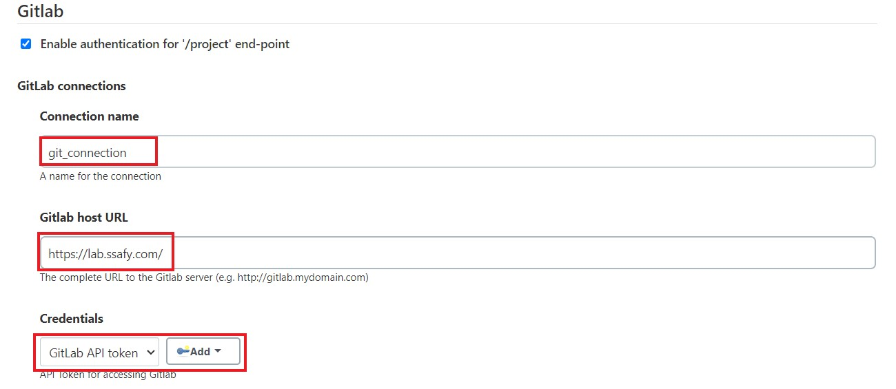

  - 아래 사진과 같이 발급받은 `API token`을 넣어준다.

    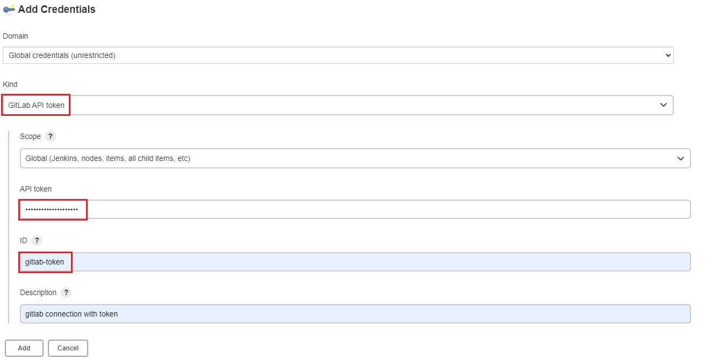

  - `Test Connection` 클릭 후 **Success** 뜨면 성공

## 5. Jenkins 새로운 Item 생성

### 5.1 Freestyle Project 생성

- **Dashboard > 새로운 Item > Freestyle project** 클릭

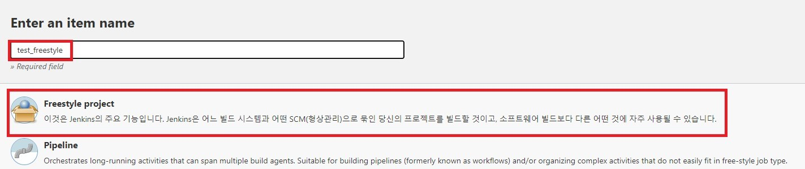

> #### [참고] item 설명
>
> - Freestyle project : 자신이 원하는 형태 및 스크립트로 빌드 진행
> - Pipeline : Jenkins Script를 직접 작성하거나 Jenkinsfile을 선택하여 빌드 진행

### 5.2 Freestyle Project 설정

- **소스 코드 관리**에서 git 선택

  - `Repository URL`에 gitLab 저장소 주소 적고, **Credentials**를 설정하기 위해 `Add` 버튼 클릭

  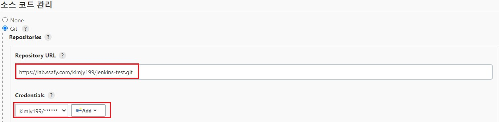

  - Gitlab의 **사용자명과 비밀번호**를 입력한다.

  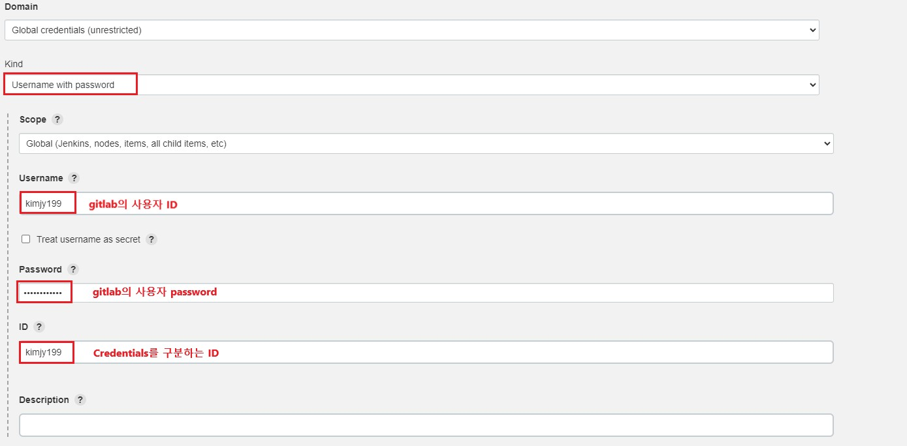

### 5.3 Web hook 설정

- **Secret Token** 생성하기

  - **Build Trigger(or 빌드 유발) > Build when a change is pushed to GitLab. ~~** 선택
  - **고급 버튼 > Secret token의 Generate** 클릭 후 **Secret Token 생성** 후 복사

  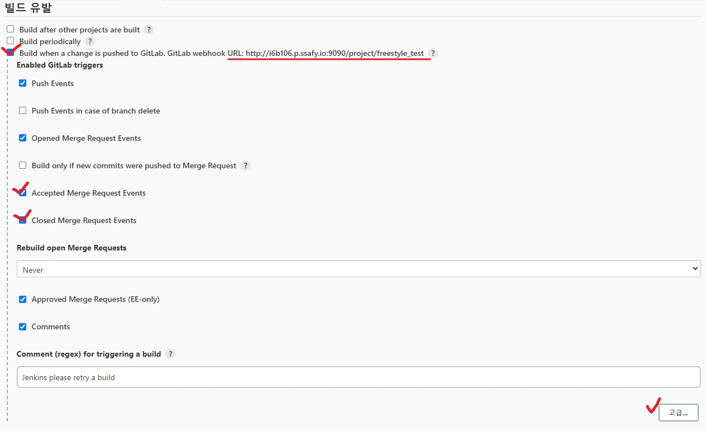

- **Gitlab Trigger** 설정

  - **Gitlab → Settings > Webhooks**에서 발급받은 **Secret Toekn** 입력
  - URL에 Jenkins 작업 item의 URL 입력 (위 이미지 참고)

  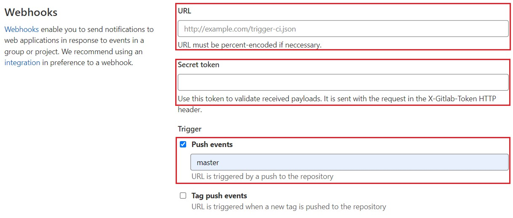

- 위 설정을 모두 마친 뒤 `Add Webhook`을 누르면 **Project Hooks**가 추가된다. 

  - **Test > Push events**를 눌러 잘 연결되었는지 확인한다.
  - 상단에 **Http 200**이 나오면 성공

  

## 6. Freestyle project 실행

### 6.1 Dockerizing

- **spring boot** 프로젝트 내에 **Dockerfile 생성**

  ```dockerfile
  # JDK11 기반으로 도커 이미지 생성
  FROM openjdk:11-jdk
  
  # JAR_FILE 위치에 있는 jar파일을 app.jar이름의 파일로 복사
  ARG JAR_FILE=build/libs/artSider-0.0.1-SNAPSHOT.jar
  COPY ${JAR_FILE} app.jar
  
  # 8080 포트 사용
  EXPOSE 8080
  ENTRYPOINT ["java","-jar","/app.jar"]
  ```
  
- **frontend** 프로젝트 내에 **Dockerfile 생성**

  ```dockerfile
  FROM node:lts-alpine as build-stage
  WORKDIR /app
  COPY package*.json ./
  
  # 복사할 파일 경로 : 이미지에서 파일이 위치할 경로
  COPY . .
  RUN npm install
  RUN npm run build
  
  # production stage
  FROM nginx:stable-alpine as production-stage
  ## COPY <호스트OS 파일 경로> <Docker 컨테이너 안에서의 경로>
  COPY  ./nginx/nginx.conf /etc/nginx/conf.d/default.conf
  
  COPY --from=build-stage /app/dist usr/share/nginx/html
  EXPOSE 80
  CMD ["nginx", "-g", "daemon off;"]
  ```

- **fastApi** 프로젝트 내에 **Dockerfile** 생성

  ```dockerfile
  FROM tiangolo/uvicorn-gunicorn:python3.8
  
  # 작업디렉토리 설정
  WORKDIR /code
  
  COPY ./requirements.txt /code/requirements.txt
  
  ### install dependencies ###
  
  # java stuff
  RUN apt-get update && \
      apt-get install -y curl openjdk-11-jdk
  
  # install python packages
  RUN pip3 install --upgrade pip
  RUN pip3 install --no-cache-dir --upgrade -r /code/requirements.txt
  
  # install mecab
  RUN cd /code && \ 
      curl -s https://raw.githubusercontent.com/konlpy/konlpy/master/scripts/mecab.sh | bash -s
  
  # 현재경로에 존재하는 app의 모든 소스파일을 /code/app 경로 이미지에 복사
  COPY ./app /code/app
  
  EXPOSE 8000
   
  CMD ["uvicorn", "app.main:app", "--host", "0.0.0.0", "--port", "8000"]
  ```

### 6.2 Execute shell 작성

- **Build > Add build step > Execute shell** 선택하고 **실행 명령어** 작성

  - `Build`란 코드를 어떻게 Build할 것인지 순서와 명령어를 입력한다.

  - `Execute shell`을 3개 생성하여 각각 **spring boot와 frontend, fastapi**를 실행한다.

    ```bash
    echo "====================================\n spring용 도커 이미지 빌드 및 실행 \n===================================="
    
    cd backend/backSpring
    
    # 권한 주기
    chmod +x gradlew
    
    # BackEnd 프로젝트 Build
    ./gradlew clean build
    
    # spring 이미지 빌드
    # docker build -t [이미지명] [Dockerfile위치]
    docker build -t spring ./
    
    # 기존 컨테이너 정지 : docker ps -f name=[컨테이너이름] -q | xargs --no-run-if-empty docker container stop
    docker ps -f name=back_spring  -q | xargs --no-run-if-empty docker container stop  
    
    # 기존 컨테이너 삭제 : docker container ls -a -f name=[컨테이너이름] -q | xargs -r docker container rm
    docker container ls -a -f name=back_spring -q | xargs -r docker container rm
    
    # 태그와 이름이 없어 <none>으로 표시된 도커 이미지 삭제
    docker images -f dangling=true && docker rmi $(docker images -f dangling=true -q)
    
    # back_spring 컨테이너 생성 및 실행
    # docker run -d -p [호스트포트]:[컨테이너포트] --name [컨테이너이름] [이미지명]
    docker run -d -p 8080:8080 --name back_spring spring
    ```
    
    > `bash: ./gradlew: Permission denied`와 같은 **Permission denied(권한거부)** 가 발생하면 `chmod +x gradlew` 를 통해 권한을 주면 된다.
    >
    > `Remove one or more images` 라는 메세지가 나온다면 `<none>`으로 표시된 이미지가 없다는 의미. 해당 코드를 지우고 실행한다.
    
    ```bash
    echo "====================================\n frontend용 도커 이미지 빌드 및 실행 \n===================================="
    docker build -t front ./
    
    docker ps -f name=front  -q | xargs --no-run-if-empty docker container stop  
    docker container ls -a -f name=front -q | xargs -r docker container rm
    
    docker run -d -p 80:80 -p 443:443 --name front -v /etc/letsencrypt:/etc/letsencrypt front
    ```
    
    ```bash
    echo "====================================\n fastApi용 도커 이미지 빌드 및 실행 \n===================================="
    docker build -t fastapi ./backend/fastApi
    
    docker ps -f name=fastapi  -q | xargs --no-run-if-empty docker container stop  
    docker container ls -a -f name=fastapi -q | xargs -r docker container rm
    
    docker run -d -p 8000:8000 --name fastapi fastapi
    ```
  
- **빌드 후 조치 > 빌드 후 조치 추가 > Publish build status to GitLab**으로 설정

  - `빌드 후 조치`란 빌드가 완료됐을 때 어떻게 할 것인가를 지정한다. 
  - Jenkins Build가 성공한다면 다음과 같이 Gitlab에 표시가 나타나게 된다.

  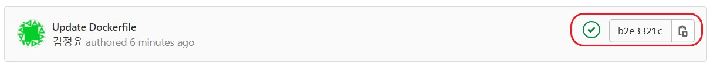

## Ref

- vue Dockerfile
  - https://v2.vuejs.org/v2/cookbook/dockerize-vuejs-app.html
- spring boot Dockerfile
  - https://spring.io/guides/gs/spring-boot-docker/
- fastApi Dockerfile 참고
  - https://fastapi.tiangolo.com/uk/deployment/docker/
  - https://github.com/tiangolo/uvicorn-gunicorn-fastapi-docker
  - https://hub.docker.com/r/theeluwin/ubuntu-konlpy/dockerfile
