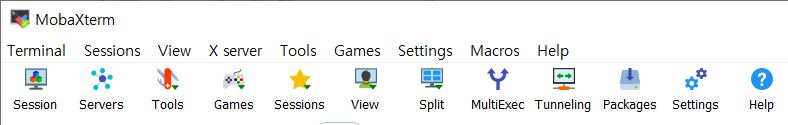
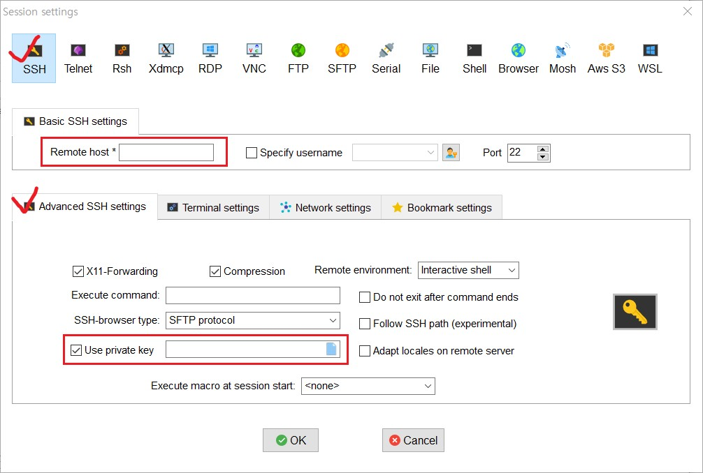

# Server, EC2 환경 설정

## 목차

1. [MobaXterm으로 EC2 접속](1.-MobaXterm으로-EC2-접속)
2. [Ubuntu 방화벽 설정](2.-Ubuntu-방화벽-설정)

------

## 1. MobaXterm으로 EC2 접속

- CLI를 다루는 도구 중 하나인 **MobaXterm** 를 이용

  - MobaXterm Free 버전 다운로드: https://mobaxterm.mobatek.net/download.html
  - Download now 클릭 후 'MobaXterm Home Edition vXX.X (Portable edition)'로 설치
  - MobaXterm.exe 실행

- 실행 창의 위쪽에 `Session` 클릭

  

- `SSH` 클릭 > `Advanced SSH settings` 선택

- EC2 인스턴스 정보로 빈 칸을 채워 넣어야 한다.

  - `Remote host` : EC2 세부정보의 퍼블릭 IPv4 주소 입력
  - `Use private key` : 다운받았던 `.pem` 키 경로를 입력

  

- Key fingerprint 관련 메시지가 나올 경우 Yes를 입력하기

> ※ Git Bash를 이용하는 경우
>
> ``` bash
> $ chmod 400 받은키페어(.pem파일명)
> $ ssh -i 받은키페어(.pem파일명) ubuntu@AWS에적힌아이피
> ```

## 2. Ubuntu 방화벽 설정

- 사용할 포트만 허용하기

  ```bash
  $ sudo ufw status			# UFW
  $ sudo ufw enable 			# UFW 활성화
  $ sudo ufw allow 22			# tcp/udp 22번 포트 모두 허용
  $ sudo ufw allow 80			# tcp/udp 80번 포트 모두 허용
  $ sudo ufw status			# UFW 상태 확인
  ```

## 참고

- [MobaXterm으로 EC2 접속하기](https://hanjo8813.github.io/devops/1/)

- [Ubuntu 방화벽 설정하기](https://milkye.tistory.com/343)