# 시연 시나리오

아트사이더는 사용자 맞춤 추천 서비스이기 때문에 로그인을 진행해야만 이용할 수 있습니다.

회원가입과 로그인을 진행합니다. 

- 로그인 하러가기 버튼 클릭

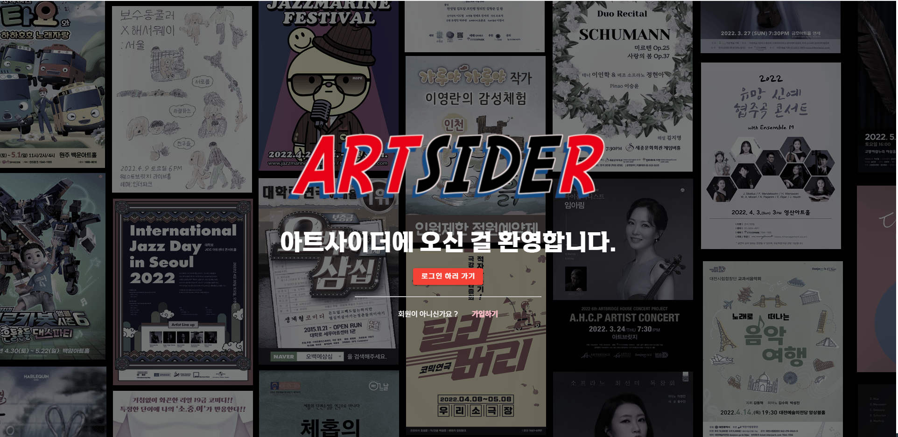

- 테스트 아이디/비밀번호로 로그인 진행
  - id: ssafy!@naver.com
  - pass:ssafy

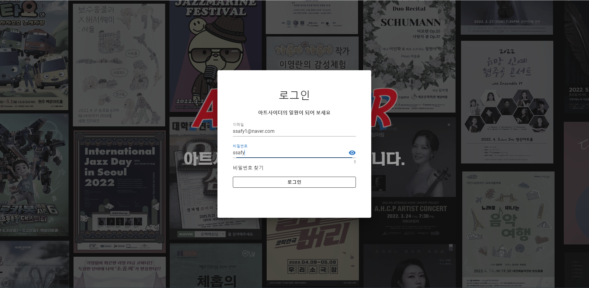

- 로그인 후 메인화면으로 진입
  - 사용자가 처음 접속하면 사용자 맞춤 추천을 제공하기 위해 관심공연을 추가하도록 하는 모달창 생성
  - 맞춤공연이 추가되어있을 경우 메인화면 진입
  - 사용자의 유사도를 기반으로 유사한 사용자가 좋아하는 공연 추천

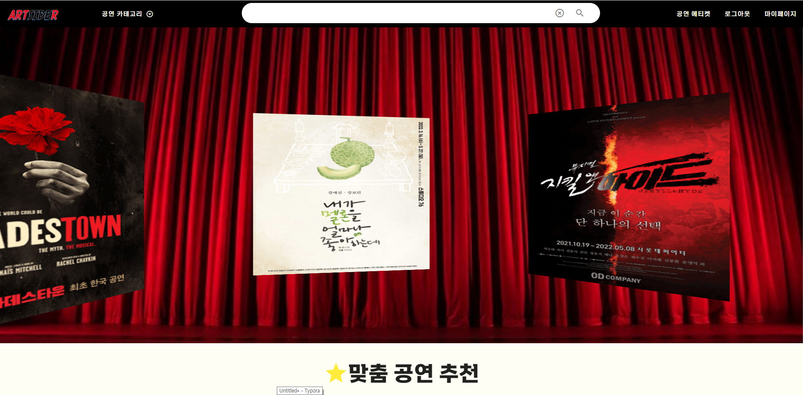

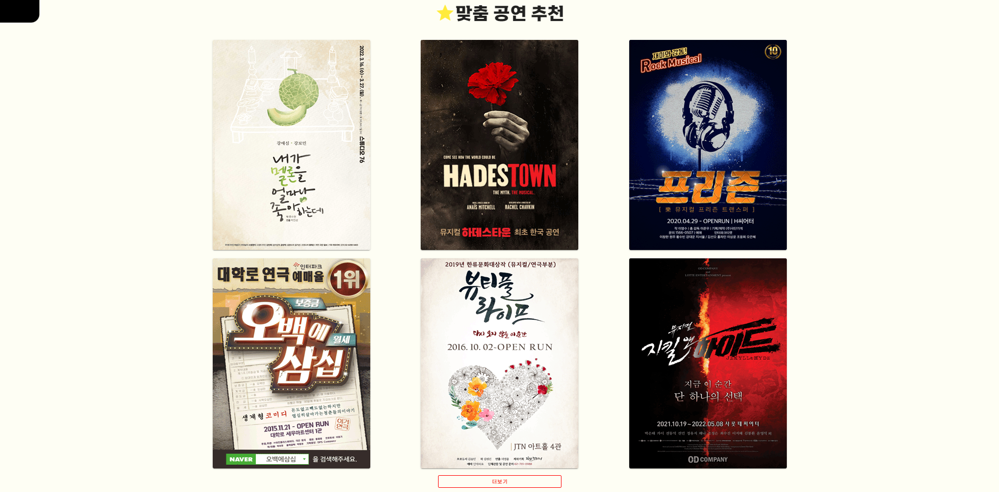

- 스크롤 후 밑의 더보기 클릭
- 여러 추천 항목 제공
  - 예매수를 기준으로 한 인기순위
  - 상영 종료일이 임박한 곧 상영 마감 
  - 상영 시작일이 임박한 곧 상영 예정
  - 사용자 유사한 사용자가 본 공연 추천
  - 사용자 태그 기반으로 태그에 해당하는 공연 추천

- 카테고리별 선택
- 좌측 상단 네브바의 카테고리 클릭
  - 뮤지컬 선택시 뮤지컬에 해당하는 공연만 추천

- 공연 상세정보
  - 공연을 좋아할 확률이 오른쪽 상단에 빨간색으로 제공
  - 공연의 다양한 정보들 제공
  - 포스터 밑에 리뷰를 기반으로 추출한 공연의 태그정보 제공
  - 오른쪽 리모콘메뉴에는 태그 유사도를 계산해서 현재 조회한 공연과 비슷한 공연 추천 
  - 예매하러가기 클릭시 해당하는 공연의 인터파크 예매사이트로 이동 

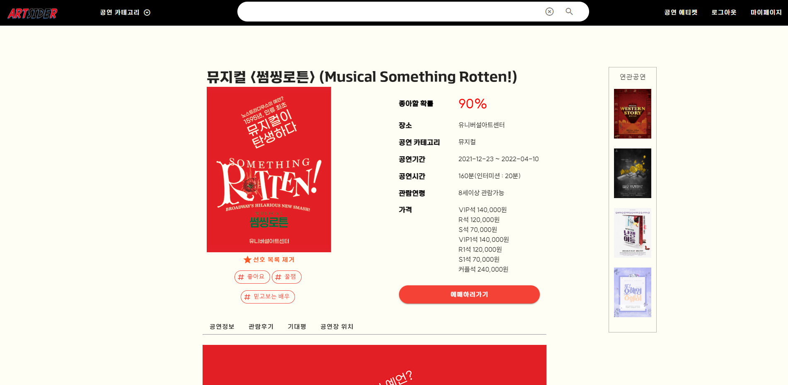

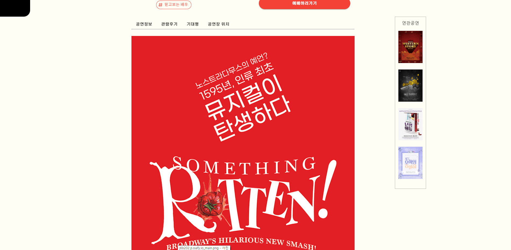

- 관람후기 입력/수정/삭제 

  - 평점과 후기 입력/수정/삭제

  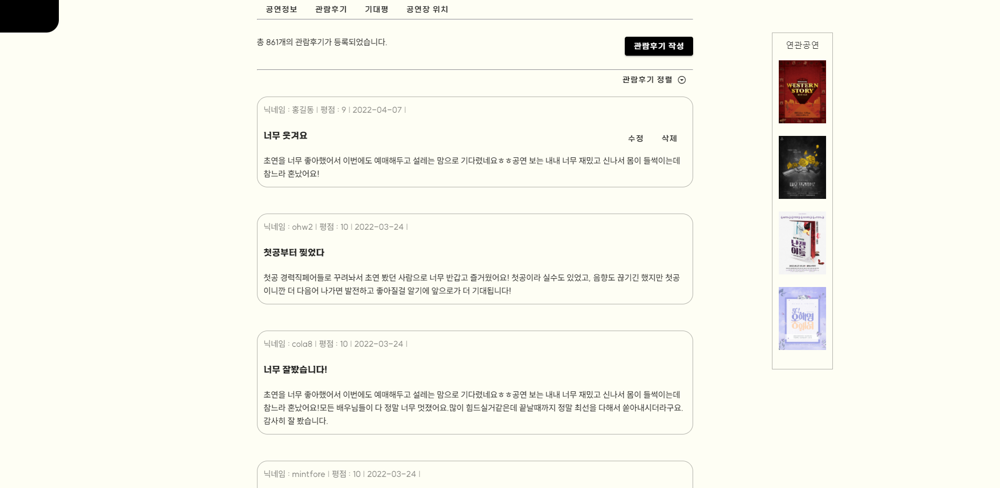

- 기대평 입력/수정/삭제 
  - 기대평 입력 

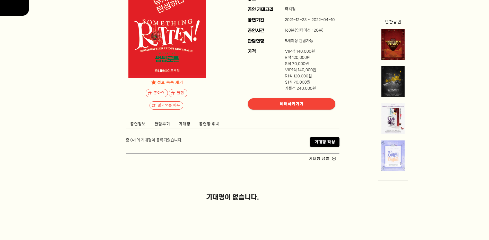

- 공연장 위치 
  - 주변 문화시설과/ 주변음식점/ 주변 카페정보 제공

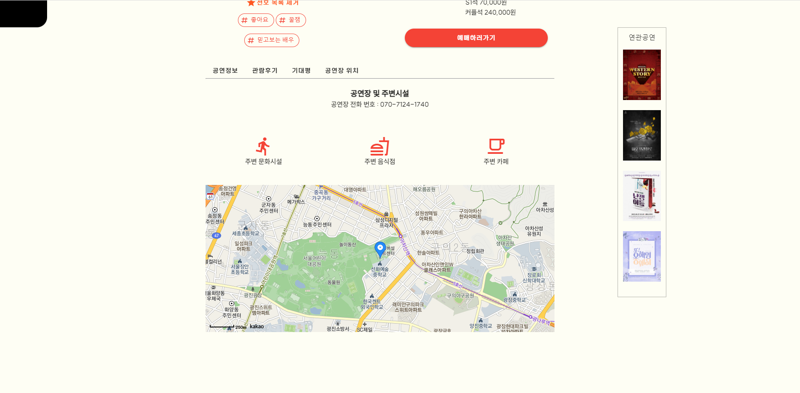

- 주변 문화시설 클릭시에 주변에 있는 문화시설 마크 제공
  - 마크 클릭시 해당하는 장소정보로 이동

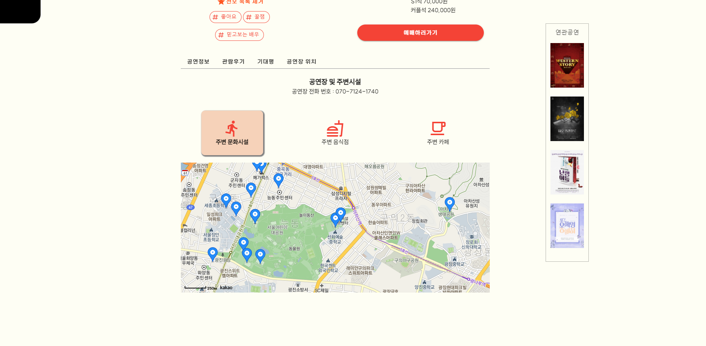

- 네비바의 공연 에티켓 클릭 
  - 공연을 처음보는 사람들을 위한 정보제공
  - 각 공연마다 에티켓 정보 제공

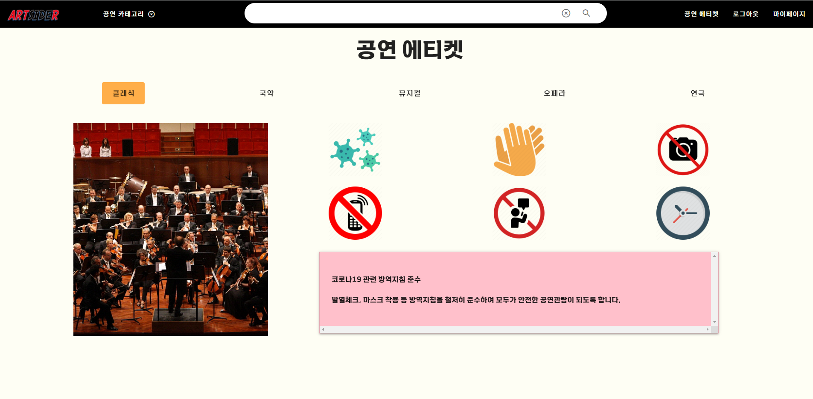

- 네비바의 마이페이지 접속
  - 사용자의 정보제공
  - 사용자의 관심공연목록에 따른 선호태그
  - 공연보관함 화면 

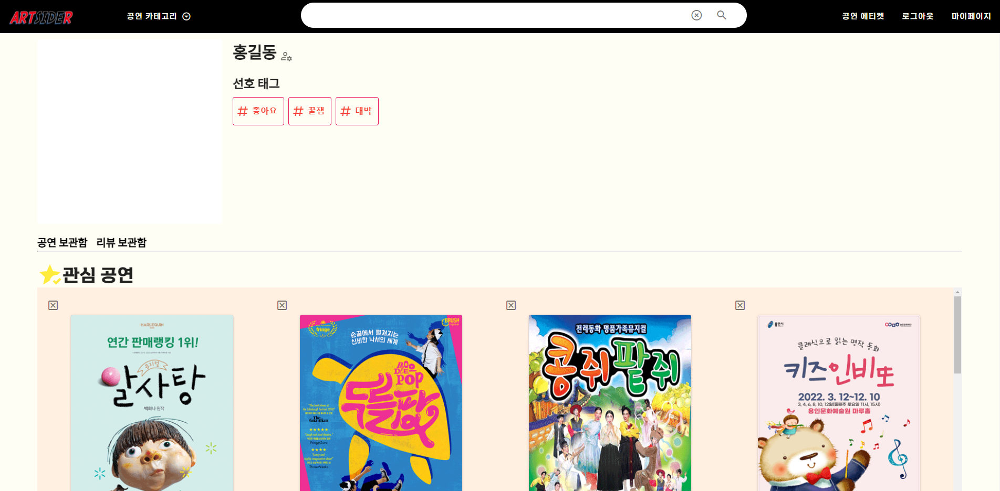

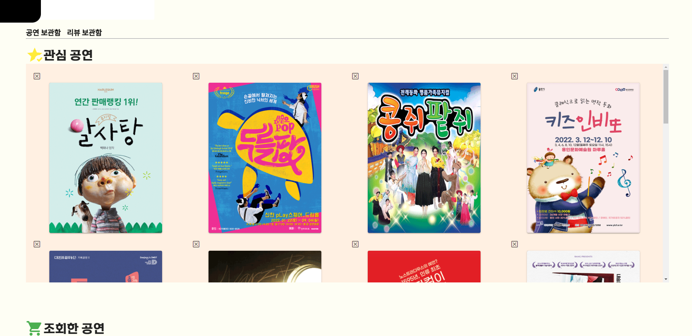

- 마이페이지 공연보관함의 조회한 공연 리스트

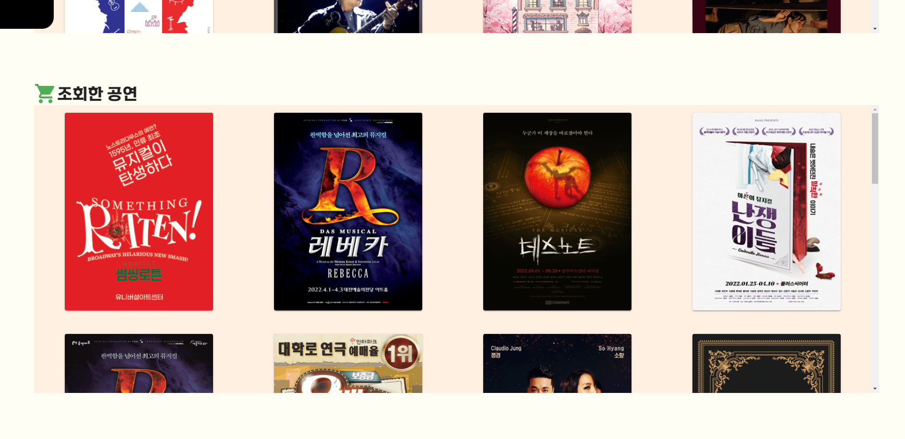

- 마이페이지 리뷰 보관함
  - 유저가 작성한 후기목록과
  - 유저가 남긴 후기목록의 별점 그래프 

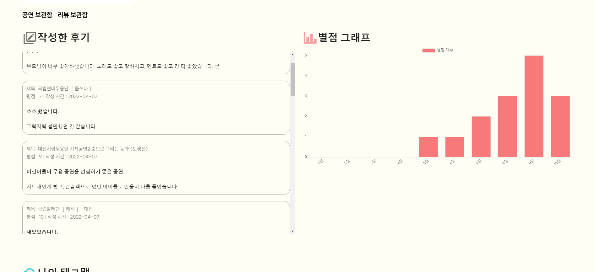

- 마이페이지 리뷰 보관함
  - 나의 태그맵
  - 사용자가 관심공연으로 선택한 공연의 태그 정보를 시각화하여 제공

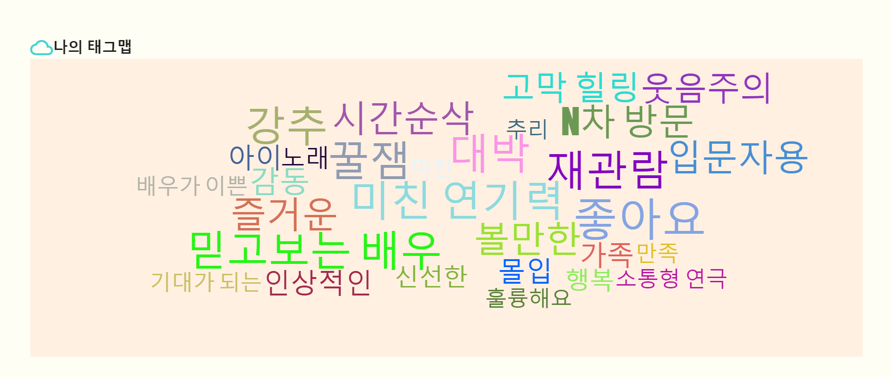

